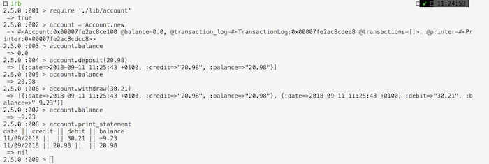
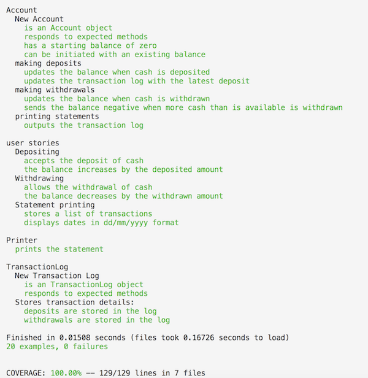

Bank Tech Test Challenge
======

It's week 10 at Makers and we are practising our tech test skills.

Specification
----
### Requirements
- [ ] You should be able to interact with your code via a REPL like IRB or the JavaScript console. (You don't need to implement a command line interface that takes input from STDIN.)
- [ ] Deposits, withdrawal.
- [ ] Account statement (date, amount, balance) printing.
- [ ] Data can be kept in memory (it doesn't need to be stored to a database or anything).

### Acceptance criteria
Given a client makes a deposit of 1000 on 10-01-2012  
And a deposit of 2000 on 13-01-2012  
And a withdrawal of 500 on 14-01-2012  
When she prints her bank statement  
Then she would see:  

```
date || credit || debit || balance
14/01/2012 || || 500.00 || 2500.00
13/01/2012 || 2000.00 || || 3000.00
10/01/2012 || 1000.00 || || 1000.00
```

Coding Approach
-----
Without any requirement to run a GUI I have opted to write this in Ruby as I have most familiarity with the language. Following initial feedback of my initial attempt, I re-worked my code to further separate my class functionality and ensured that all formatting of data was carried out in the presentation class rather than mixed in with the business logic.

Following my final feedback, I would consider making the following changes: 
- There is still not have enough responsibility within my TransactionLog class and that suggests it is perhaps not necessary to extract as an individual class
- The new functionality to extract row level data for the statement printer is more abstract than the string interpolation method I'd used previously
- I could have tested for more edge cases. For example, while the specification didn't suggest that going overdrawn was a problem, it is a common restriction and I could have provided alert messages at least. Likewise I haven't provided a capture mechanism for negative withdrawal & deposit amounts or non-number entries.

### User Stories
```
As  user
With excess cash
I would like to be able to deposit money
```
```
As a user
Who sometimes runs short of cash
I would like to be able to withdraw money
```
```
As user
Who likes to know whats going on
I would like to be able to view a list of my transactions
```
```
As a user
Who isn't familiar with timestamps
I would like my statement to show dates as dd/mm/yyyy
```

### How to install, run and test

- `git Clone https://github.com/Whatapalaver/bank_tech_test`
- `bundle install`
- run `rake` for testinmg
- run `irb` and load the main account file (require './lib/account.rb')
- create new Account `account = Account.new` add an argument if you want to initiate with an existing balance
- Example irb test below but the following actions are allowed:
```
account.balance
account.deposit(amount, date(dd/mm/yyyy)) date defaults to now if omitted
account.withdraw(amount, date(dd/mm/yyyy)) date defaults to now if omitted
account.print_statement
```

*Example irb console test:*

```
require './lib/account'
account = Account.new
account.balance
account.deposit(20.98)
account.balance
account.withdraw(30.21)
account.balance
account.print_statement
```

irb console output:



*Test coverage*



*irb test for acceptance criteria*
```
require './lib/account'
account = Account.new
account.deposit(1000, Date.parse('10/01/2012'))
account.deposit(2000, Date.parse('13/01/2012'))
account.withdraw(500, Date.parse('14/01/2012'))
account.print_statement 
```
